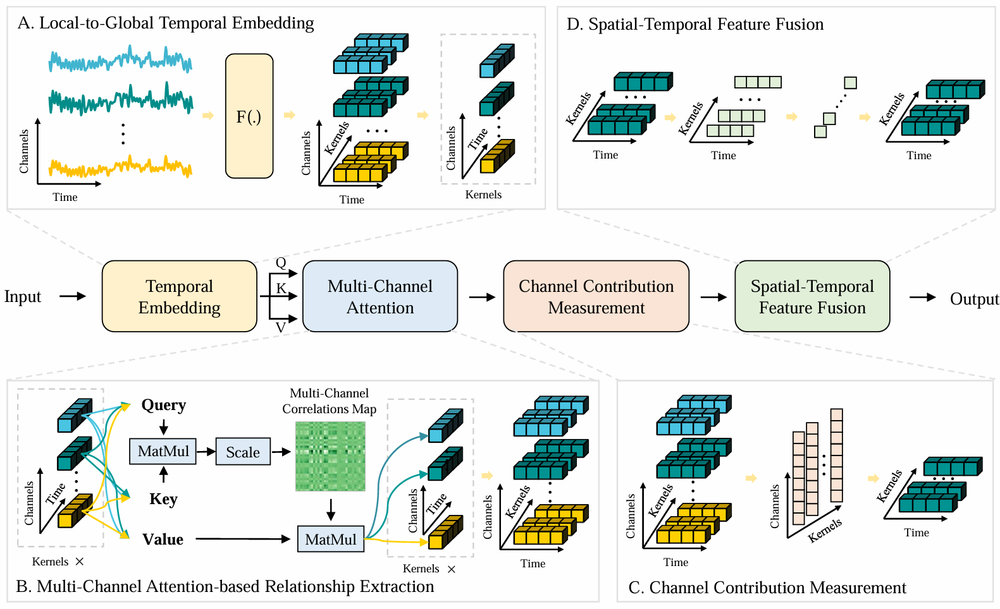

## PhyTransformer: A Unified Framework for Learning Spatial-Temporal Representation from Physiological Signals

Created by Hongxin Li, Yaru Liu, Kun Liu, Yuke Qu, Wei Dai, Jingsheng Tang, and Zongtan Zhou from the National University of Defense Technology.

## Introduction
As a modal of physiological information, electroencephalogram (EEG), surface electromyography (sEMG), and eye tracking (ET) signals are widely used to decode human intention, promoting the development of human-computer interaction systems. Extensive studies have achieved single-modal signal decoding with substantial structural differences, but consuming mass computing resources and development costs. Considering the similarity in data structure and features, this work proposed a unified framework called PhyTransformer that extracts temporal dynamic and complex channel relationships to decode the physiological signals generally. Concretely, PhyTransformer uses a stacked distillation convolution to capture the complementary temporal dynamic representation from local to global. Considering the information fusion between different channels, our method regards the temporal dynamic of each channel as a token and feeds them into the multi-head attention network to model the complex channel relationship. Subsequently, to measure the channel contributions and fuse the representations from different convolution kernels, PhyTransformer adopts a depth-wise and a separable-wise convolution to extract the final spatial-temporal representation. The proposed method has been evaluated on six publicly benchmark datasets for physiological signal classification, namely THU and GIST for EEG, Ninapro DB 1 and 6 for sEMG, and GazeCom and HMR for ET. Experiment results illustrate the proposed method PhyTransformer has the ability to learn robust spatial-temporal representations from multiple modal physiological signals.

